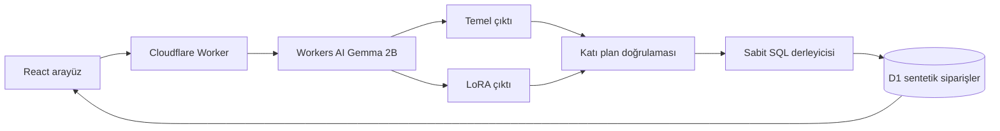

# TR-Query

**Türkçe analitik sorular için ölçülebilir bir LoRA deneyi.** Kurgusal bir perakende operasyonundaki soruları dört alanlı sorgu planına çevirir. Uygulama aynı Gemma 2B temel modelini LoRA adapterı olmadan ve adapterla çalıştırır; planı, bu plandan derlenen salt okunur SQL'i ve sentetik verideki sonucu yan yana gösterir.

> **Durum:** Yerel uygulama ve eğitim hattı hazır. Eğitilmiş adapter ve herkese açık demo henüz doğrulanmadı. Canlı URL, model değerlendirme rakamları ve dağıtım kanıtı ancak gerçek eğitim ve yayın sonrasında eklenecek.

[English README](README.en.md) · [Mimari](docs/architecture.md) · [Değerlendirme](docs/evaluation.md) · [Dağıtım ve maliyet](docs/operations.md)

## Neden bu proje?

RAGNA retrieval ve kaynaklı yanıtı, ServiceOps insan onaylı ajan yürütmesini gösteriyor. Bu proje model uyarlamasını inceliyor: **LoRA, güçlü bir prompt'a göre ne kazandırıyor ve bedeli ne?** Sonucun iyileşeceği önceden varsayılmıyor. Başarısız örnekler ve test koşulları raporda korunacak.

## Canlı demoda ne olur?

1. Ziyaretçi Türkçe bir operasyon sorusu yazar veya üç örnekten birini seçer.
2. Aynı soru temel modele ve LoRA adapterlı modele gönderilir.
3. Her çıktı katı JSON şemasından geçirilir. Modelden gelen SQL yürütülmez.
4. Geçerli plan, uygulamanın sabit ve parametreli SQL derleyicisinden geçer; D1 sorgusu sonucu döner.
5. Kullanıcı iki modelin planını, sorgusunu, sonucunu ve gecikmesini görür.

Demo verisi 18 sentetik siparişten oluşur. Dönem kıyasının referans tarihi **30 Eylül 2026** olarak sabitlenmiştir; zaman geçtikçe sonuçların kayması önlenir. Şehir, metrik, grup ve dönem dışındaki sorular bu sürümün kapsamı dışındadır. Geçersiz çıktı açıkça hata olarak gösterilir; sessizce doğru cevaba çevrilmez.

## Mimarinin kısa özeti



Eğitim hattı Python, PyTorch, Transformers ve PEFT kullanır. **Standart LoRA** seçildi: `r=8`, `alpha=16`, `q_proj` ve `v_proj`; temel ağırlıklar değiştirilmez ve 4 bit kuantizasyon uygulanmaz. Cloudflare'ın LoRA beta hizmeti PEFT biçimindeki `adapter_config.json` ile `adapter_model.safetensors` dosyalarını bekler. Tam ayarlar ve test yöntemi [değerlendirme rehberinde](docs/evaluation.md).

## Yerel başlangıç

Node.js 22.12+ ve Python 3.10+ gerekir. Mac'te eğitim için MPS destekli PyTorch, başka ortamda CUDA gerekir.

```bash
npm ci
npm run build
npm run db:local
npm run preview
```

`http://localhost:8789` açılır. Adapter yüklenene kadar arayüz çalışır, karşılaştırma düğmesi dürüstçe devre dışıdır. `wrangler dev` AI binding'i uzaktaki servise bağlar; model çağrıları ücretsiz kotayı tüketebilir. Yerel veritabanı işlemleri yalnızca yerel D1'i değiştirir.

Eğitim verisini yeniden üretmek için:

```bash
python3 training/generate_data.py
python3 -m venv .venv
.venv/bin/pip install -r requirements.txt
.venv/bin/python training/train.py --steps 240
.venv/bin/python training/evaluate.py --limit 96
.venv/bin/python training/prepare_upload.py
```

Gemma model dosyaları için Hugging Face hesabınızda Google'ın kullanım koşulları kabul edilmiş ve terminal oturumu açılmış olmalıdır. Tokenı kaynak koda, komut argümanına veya Git'e koymayın. `prepare_upload.py`, değerlendirme için kullanılan özgün PEFT adapterını değiştirmeden Cloudflare'ın beklediği iki dosyayı hazırlar. Mac model dosyalarını indirirken birkaç GB boş alan gerekir. `artifacts/` ve `.venv/` Git dışında tutulur.

## Test ve sonuç sözleşmesi

```bash
npm test
npm run build
python3 training/generate_data.py
```

`data/train.jsonl`, `valid.jsonl` ve `test.jsonl` deterministik olarak üretilir. Test cümle kalıpları eğitimden ayrıdır; aynı metrik/grup/dönem/şehir kombinasyonları ayrılmadığı için bu deney **yeni şemalara genelleme kanıtı değildir**. Veriler sentetiktir ve henüz insan incelemesinden geçmemiştir. Değerlendirme, geçerli plan oranını, tam plan doğruluğunu, sorgu sonucu eşitliğini ve gecikmeyi ölçer. Sonuçlar gerçek müşteri verisi veya saha etkisi diye sunulmaz.

GitHub Actions her push ve PR'da plan testlerini, uygulama derlemesini, Python sözdizimini ve veri üretiminin tekrar üretilebilirliğini kontrol eder. Gated model ağırlıkları CI'a yüklenmez; LoRA sonuçları ayrı yerel değerlendirme ile raporlanır.

## Ücretsiz kullanım sınırı

Eğitim yerel donanımda yapılır. Cloudflare Workers AI LoRA adapter kullanımı açık beta döneminde ücretsizdir; model çağrıları hesap genelindeki günlük ücretsiz AI kotasıyla sınırlıdır. Demo ayrıca günde en fazla 10 karşılaştırma kabul eder. Kota dolduğunda hata gösterir; ücretli sağlayıcıya otomatik geçmez. Beta ve ücretsiz katman şartları değişebilir. Ayrıntılar [işletim rehberinde](docs/operations.md).

## Kaynaklar

- [Cloudflare LoRA adapter koşulları](https://developers.cloudflare.com/workers-ai/features/fine-tunes/loras/)
- [Cloudflare Workers AI fiyatlandırması](https://developers.cloudflare.com/workers-ai/platform/pricing/)
- [Gemma 2B model kartı ve kullanım koşulları](https://huggingface.co/google/gemma-2b-it)
- [Hugging Face PEFT LoRA](https://huggingface.co/docs/peft/main/package_reference/lora)
